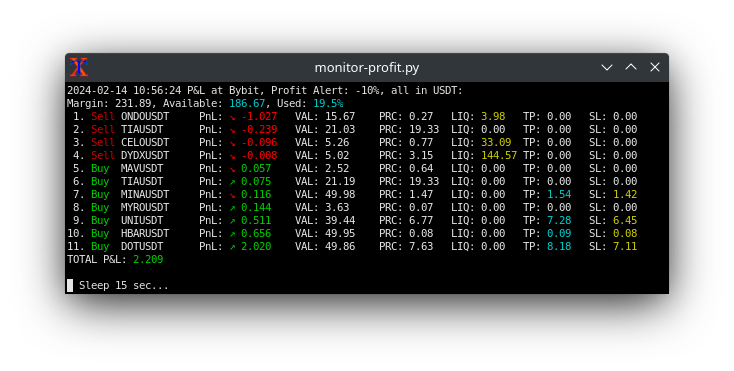

# bybit_monitor

For Bybit Crypto Exchange: Account / Orders / Coin Price monitor. In Python, using Pybit lib.

https://github.com/sergeymusenko/bybit_monitor

**THIS IS A DRAFT, sorry, not ready yet...** 
I will implement Websockets later.

Set of Trading Monitor Bots based on Pybit for Bybit Exchange:

- `monitor-overview` - Account Balance and all Positions/Orders
- `monitor-price   ` - Price monitor Coin/USDT
- `monitor-profit  ` - P&L of all Positions and Spot Limit Orders

All bots could send Telegram notifications

**Installation:**
> `pip install pybit`

**Console version: **
